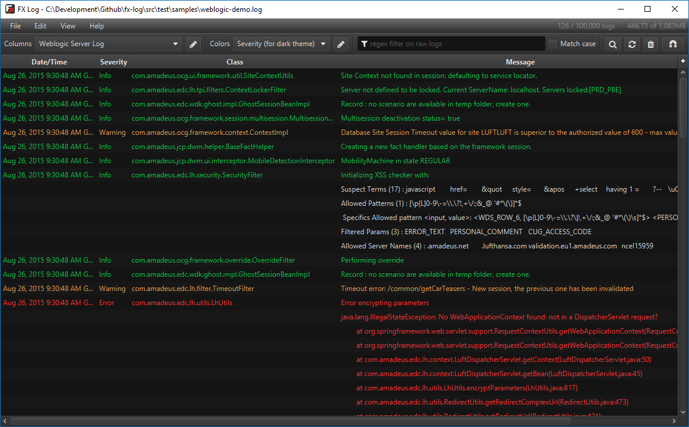
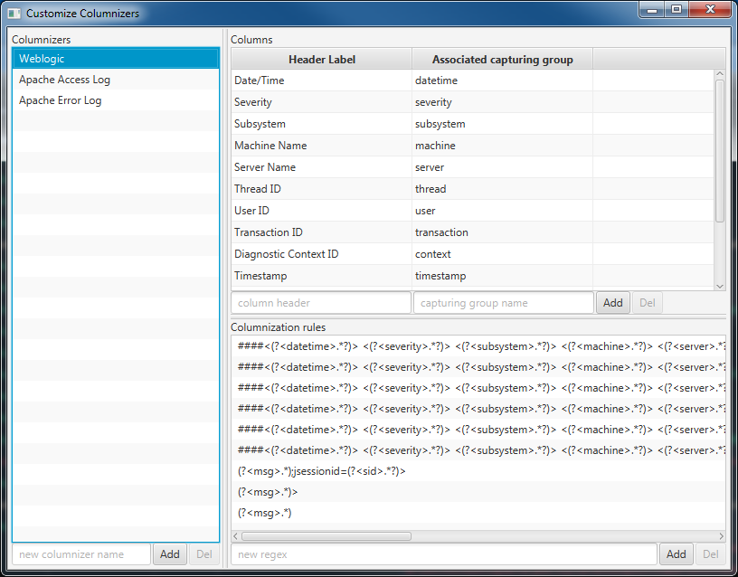
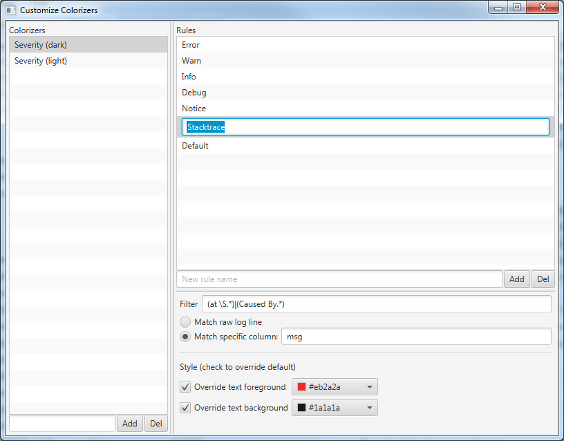

# FX Log

A clean and free log viewer.

## Download

You can find the executable Jar in [FX Log bintray repository](https://bintray.com/joffrey-bion/applications/fx-log/).

## What does it look like?

Wanna go dark?

## Features

### Tailing

FX Log follows the end of your file and streams in real time.

### Filtering

Show only the interesting logs at any time.

### Columnization

Use regular expressions to parse your raw log lines into nice columns:

Built-in support is already included for standard server logs.

### Colorization

Use regular expressions on raw log lines or column values to change the style of some logs:

