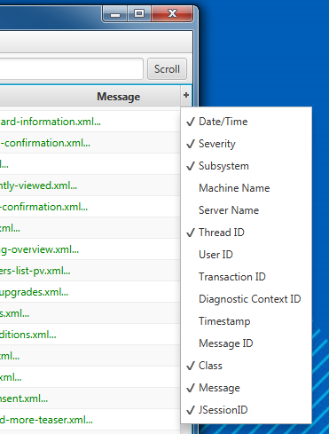

# FX Log

A clean and free log viewer.

## Download

You can find the executable Jar in the
[FX Log bintray repository](https://bintray.com/joffrey-bion/applications/fx-log/).

## What does it look like?

Light Theme & Light Colorizer                                     |  Dark Theme & Dark Colorizer
:----------------------------------------------------------------:|:----------------------------------------------:
  |  

## Features

### Tailing

FX Log follows the end of your file and streams in real time.

### Filtering

Choose the logs that matter to you at any time.

### Columnization

Use regular expressions to parse your raw log lines into nice columns. Built-in support is already included for
standard server logs like Weblogic and Apache.

Custom columnizer                                                   |  Select interesting columns
:------------------------------------------------------------------:|:----------------------------------------------:
 | 

### Coloration

Use regular expressions on raw log lines or column values to change the style of some logs:

## Report issues - Suggest improvements

You can suggest improvements or report problems in the [GitHub issue page](https://github.com/joffrey-bion/fx-log/issues).

## Contribute

In order to contribute, you will need [Gradle](http://gradle.org/gradle-download/) and at least JDK 8 u40.
You might also find the [Java FX Scene Builder](http://gluonhq.com/open-source/scene-builder/) pretty useful to edit
the views.
